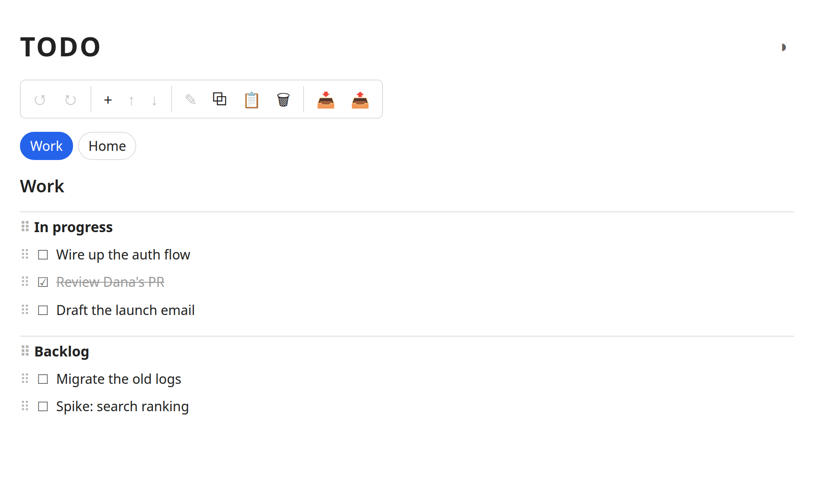
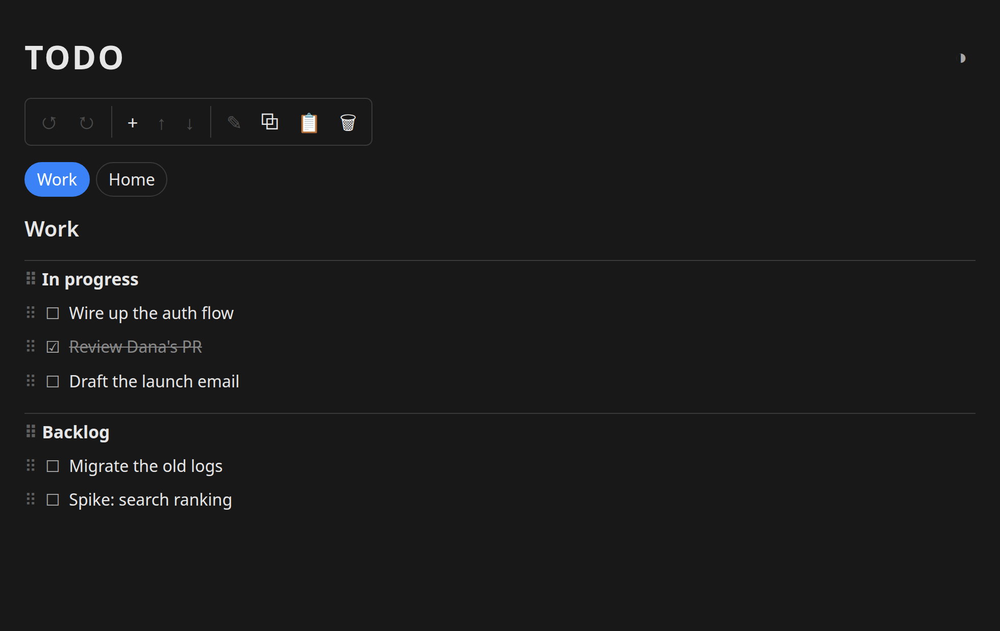

# TODO

A tiny **boards › lists › tasks** todo app in a single file: pure HTML/CSS/JS, state in `localStorage`. No server, no build, no dependencies.

**Live:** https://todo.surf

## Try it

Open [`index.html`](index.html) in a browser, or visit the [live page](https://todo.surf). Everything is saved in your browser's `localStorage` — it never leaves your machine (and so does not sync across devices).

## Quick guide

Everything runs from the **toolbar**. Click a board name, list name, or task to **select** it (blue outline); the toolbar then acts on that selection. Click empty space to deselect.

| Button | Action |
|:------:|--------|
| ↺ / ↻ | **Undo / Redo** — up to 10 steps |
| **+** | **Add** — a task under the selected list, a list under the selected board, or a new board when nothing is selected |
| ↑ / ↓ | **Move** the selection up or down |
| ✎ | **Edit** the selection inline (type, `Enter` to save, `Esc` to cancel) |
| ⧉ | **Duplicate** the selection in place (current board if nothing is selected) |
| 📋 | **Copy to clipboard** — the selected board/list/task as JSON (current board if nothing is selected) |
| 🗑 | **Delete** the selection (current board if nothing is selected) |
| 📥 / 📤 | **Import / Export** — merge a JSON file into your boards, or download everything as `todo.json` |

**Import / export.** Export downloads your whole tree as `todo.json`. Import reads a file of the same shape — `{ board: { list: [ {text, done} ] } }` — and *merges* it in: new boards and lists are added, and tasks are appended to existing lists unless a task with that text is already there (so re-importing the same file is safe). A `todos.json` from the command-line version drops straight in.

More:

- **Toggle done** — click a task's checkbox.
- **Reorder** — drag the ⠿ grip on a task, list, or board pill.
- **Switch board** — click a board pill.
- **Inline add/edit shortcut** — committing an *empty* field deletes the item (a quick way to remove the thing you're editing).
- **Light / dark** — the ◑ button by the title; your choice is remembered.
- **Install it** — in Chrome/Edge an **Install app** button appears by the title; once installed it opens in its own window and works offline.

## How it works

The data is one ordered tree: `{ board: { list: [ {text, done}, … ] } }`, kept in `localStorage`. Every change records a whole-document snapshot for undo/redo — simple and always correct for data this small.
